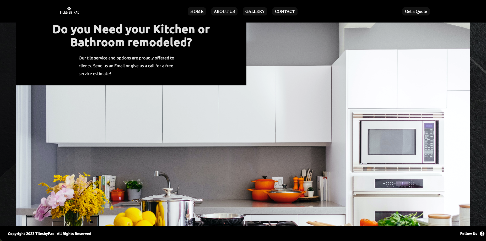

# Portfolio: <a target="_blank" href="https://moises-gomez.netlify.app/">Visit Here</a>

https://github.com/user-attachments/assets/72d07184-ea1e-48fe-8618-78f5e9948a1e

### Portfolio site including links to my projects and ways to get in contact with me.

## Tech used: 

Portfolio website designed to display my projects and work!

## Optimizations

When I improve this project, I would start by updating the recent work section. I would add newer projects. I would like to add some dark mode for a better user experience.

## Lessons Learned

My learning was focused on making a simple UI and a smooth UX. Separation of Concerns.

## More Projects

<table bordercolor="#66b2b2">
  
  <tr>
    <td width="33.3%"  style="align:center;" valign="top">
<a target="_blank" href="https://tilesbypac.netlify.app/">Tiles by Pac</a>
         
      
    </td>
    <td width="33.3%" valign="top">
<a target="_blank" href="https://moisesg526.github.io/restaurant/">The Velvet Fork"</a>
       
        
    </td>
    <td width="33.3%" valign="top">
<a target="_blank" href="https://jetsportswear.netlify.app/">Sportswear Store</a>
         
        
    </td>
  </tr>
</table>
